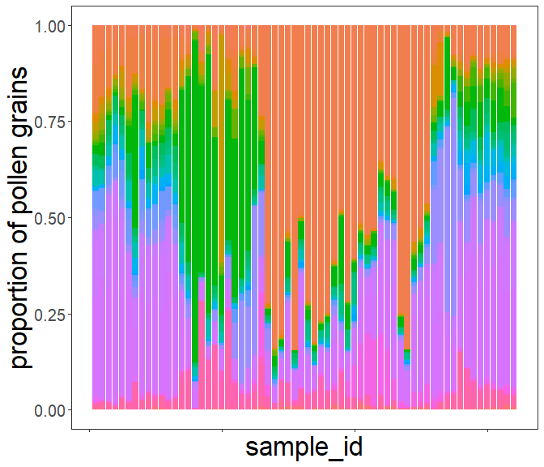
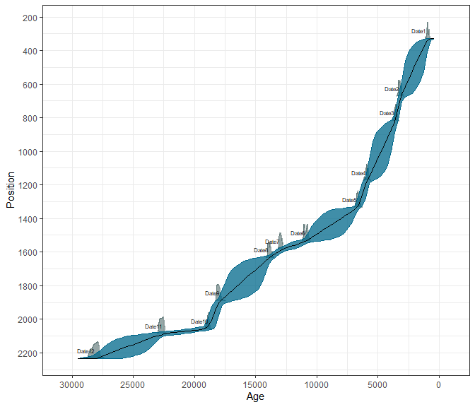
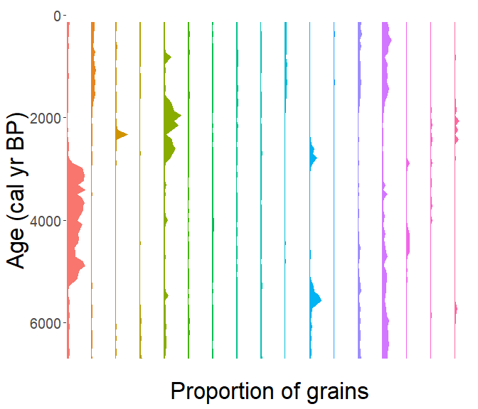

Step-by-step guide
================

This workflow should show the full strength of the [*RRatepol package*](https://hope-uib-bio.github.io/R-Ratepol-package/) and serve as step-by-step guidance starting from downloading dataset from Neotoma, building age-depth models, to estimating rate-of-change using age uncertainty.

:warning: **This workflow is only meant as an example**: There are several additional steps for data preparation which should be done to properly implement RRatepol and asssess rate of change of a fossil pollen dataset from Neotoma!

## Install packages

Please follow the [pre-workshop instructions](https://ondrejmottl.github.io/APD_R-Ratepol_workshop/pre_workshop.html) to make sure all packages are installed.

## Attach packages

``` r
library(tidyverse) # general data wrangling and visualisation
library(pander) # nice tables
library(RRatepol) # rate-of-vegetation change ! v1.2.0 !
library(neotoma2) # obtain data from the Neotoma database
library(Bchron) # age-depth modeling
library(janitor) # string cleaning
```

## Download a dataset from Neotoma

Here we have selected the **Ahakagyezi Swamp** record.

``` r
sel_dataset_download <-
  neotoma2::get_downloads(50216)
```

## Prepare the pollen counts

``` r
# get samples
sel_counts <-
  neotoma2::samples(sel_dataset_download)

# select only "pollen" taxa
sel_taxon_list_selected <-
  neotoma2::taxa(sel_dataset_download) %>%
  dplyr::filter(element == "pollen") %>%
  purrr::pluck("variablename")

# prepare taxa table
sel_counts_selected <-
  sel_counts %>%
  as.data.frame() %>%
  dplyr::mutate(sample_id = as.character(sampleid)) %>%
  tibble::as_tibble() %>%
  dplyr::select("sample_id", "value", "variablename") %>%
  # only include selected taxons
  dplyr::filter(
    variablename %in% sel_taxon_list_selected
  ) %>%
  # turn into the wider format
  tidyr::pivot_wider(
    names_from = "variablename",
    values_from = "value",
    values_fill = 0
  ) %>%
  # clean names
  janitor::clean_names()

head(sel_counts_selected)[, 1:5]
```

| sample_id | rhamnaceae | combretaceae_melastomataceae | ranunculaceae | prunus |
|:---------:|:----------:|:----------------------------:|:-------------:|:------:|
|  500543   |     1      |              1               |       1       |   1    |
|  500544   |     4      |              0               |       0       |   2    |
|  500545   |     6      |              1               |       0       |   0    |
|  500547   |     4      |              0               |       0       |   0    |
|  500548   |     7      |              0               |       0       |   0    |
|  500549   |     3      |              1               |       0       |   1    |

Here, we strongly advocate that attention should be paid to the selection of the ecological groups as well as the harmonisation of the pollen taxa. However, that is not the subject of this workflow, but any analysis to be published needs careful preparation of the fossil pollen datasets before using R-Ratepol!

We can now try to visualise the taxa per sample_id

``` r
sel_counts_selected %>%
  tibble::rowid_to_column("ID") %>%
  tidyr::pivot_longer(
    cols = -c(sample_id, ID),
    names_to = "taxa",
    values_to = "n_grains"
  ) %>%
  ggplot2::ggplot(
    mapping = ggplot2::aes(
      x = ID,
      y = n_grains,
      fill = taxa
    ),
  ) +
  ggplot2::geom_bar(
    stat = "identity",
    position = "fill"
  ) +
  ggplot2::labs(
    x = "sample_id",
    y = "proportion of pollen grains"
  ) +
  ggplot2::theme(
    axis.text.x = ggplot2::element_blank(),
    legend.position = "none"
  )
```



## Preparation of the levels

### Sample depth

Extract depth for each level

``` r
sel_level <-
  neotoma2::samples(sel_dataset_download) %>%
  tibble::as_tibble() %>%
  dplyr::mutate(sample_id = as.character(sampleid)) %>%
  dplyr::distinct(sample_id, depth) %>%
  dplyr::relocate(sample_id)

head(sel_level)
```

| sample_id | depth |
|:---------:|:-----:|
|  500543   |  703  |
|  500544   |  753  |
|  500545   |  803  |
|  500547   |  853  |
|  500548   |  908  |
|  500549   |  953  |

### Age-depth modelling

We will recalculate the age-depth model ‘de novo’ using the [*Bchron* package](http://andrewcparnell.github.io/Bchron/).

#### Prepare chron.control table and run Bchron

The chronology control table contains all the dates (mostly radiocarbon) to create the age-depth model.

Here we only present a few of the important steps of preparation of the chronology control table. There are many more potential issues, but solving those is not the focus of this workflow.

``` r
# First, get the chronologies and check which we want to use used
sel_chron_control_table_download <-
  neotoma2::chroncontrols(sel_dataset_download)

print(sel_chron_control_table_download)
```

| siteid | chronologyid | depth | thickness | agelimitolder | chroncontrolid |
|:------:|:------------:|:-----:|:---------:|:-------------:|:--------------:|
| 27552  |    35429     |  330  |    20     |     1150      |     110443     |
| 27552  |    35429     | 1892  |    16     |     14860     |     110449     |
| 27552  |    35429     | 1175  |    30     |     5250      |     110446     |
| 27552  |    35429     | 2060  |    14     |     15750     |     110451     |
| 27552  |    35429     | 2235  |    30     |     24200     |     110454     |
| 27552  |    35429     | 2087  |    27     |     18890     |     110453     |

Table continues below

| agelimityounger | chroncontrolage | chroncontroltype |
|:---------------:|:---------------:|:----------------:|
|      1010       |      1080       |   Radiocarbon    |
|      14660      |      14760      |   Radiocarbon    |
|      5110       |      5180       |   Radiocarbon    |
|      15530      |      15640      |   Radiocarbon    |
|      23680      |      23940      |   Radiocarbon    |
|      18650      |      18770      |   Radiocarbon    |

``` r
# prepare the table
sel_chron_control_table <-
  sel_chron_control_table_download %>%
  # Here select the ID of one of the chronology
  dplyr::filter(chronologyid == 35430) %>%
  tibble::as_tibble() %>%
  # Here we calculate the error as the average of the age `limitolder` and
  #   `agelimityounger`
  dplyr::mutate(
    error = round((agelimitolder - agelimityounger) / 2)
  ) %>%
  # As Bchron cannot accept a error of 0, we need to replace the value with 1
  dplyr::mutate(
    error = replace(error, error == 0, 1),
    error = ifelse(is.na(error), 1, error)
  ) %>%
  # We need to specify which calibration curve should be used for what point
  dplyr::mutate(
    curve = ifelse(as.data.frame(sel_dataset_download)["lat"] > 0, "intcal20", "shcal20"),
    curve = ifelse(chroncontroltype != "Radiocarbon", "normal", curve)
  ) %>%
  tibble::column_to_rownames("chroncontrolid") %>%
  dplyr::arrange(depth) %>%
  dplyr::select(
    chroncontrolage, error, depth, thickness, chroncontroltype, curve
  )

head(sel_chron_control_table)
```

| chroncontrolage | error | depth | thickness | chroncontroltype |  curve  |
|:---------------:|:-----:|:-----:|:---------:|:----------------:|:-------:|
|      1080       |  70   |  330  |    20     |   Radiocarbon    | shcal20 |
|      3070       |  70   |  675  |    30     |   Radiocarbon    | shcal20 |
|      3360       |  70   |  820  |    20     |   Radiocarbon    | shcal20 |
|      5180       |  70   | 1175  |    30     |   Radiocarbon    | shcal20 |
|      5870       |  90   | 1335  |    20     |   Radiocarbon    | shcal20 |
|      9580       |  60   | 1535  |    30     |   Radiocarbon    | shcal20 |

As this is just a toy example, we will use only the iteration multiplier (`i_multiplier`) of `0.1` to reduce the computation time. However, we strongly recommend increasing it to 5 for any normal age-depth model construction.

``` r
i_multiplier <- 0.1 # increase to 5

# Those are default values suggested by the Bchron package
n_iteration_default <- 10e3
n_burn_default <- 2e3
n_thin_default <- 8

# Let's multiply them by our i_multiplier
n_iteration <- n_iteration_default * i_multiplier
n_burn <- n_burn_default * i_multiplier
n_thin <- max(c(1, n_thin_default * i_multiplier))

# run Bchron
sel_bchron <-
  Bchron::Bchronology(
    ages = sel_chron_control_table$chroncontrolage,
    ageSds = sel_chron_control_table$error,
    positions = sel_chron_control_table$depth,
    calCurves = sel_chron_control_table$curve,
    positionThicknesses = sel_chron_control_table$thickness,
    iterations = n_iteration,
    burn = n_burn,
    thin = n_thin
  )
```

Visually check the age-depth models

``` r
plot(sel_bchron)
```



#### Predict ages

Let’s first extract posterior ages (i.e. possible ages) from the age-depth model.

``` r
age_position <-
  Bchron:::predict.BchronologyRun(object = sel_bchron, newPositions = sel_level$depth)

age_uncertainties <-
  age_position %>%
  as.data.frame() %>%
  dplyr::mutate_all(., as.integer) %>%
  as.matrix()

colnames(age_uncertainties) <- sel_level$sample_id

head(age_uncertainties, n = 8)[, 1:8]
```

Here we see samples (e.g., 500543,500544, 500547,…) and their possible ages (age-sequence) with each model iteration (posterior). Each age-sequence is similar but there are differences of tens or hundreds of years. We will call this *the uncertainty matrix*.

| 500543 | 500544 | 500545 | 500547 | 500548 | 500549 | 500550 | 500546 |
|:------:|:------:|:------:|:------:|:------:|:------:|:------:|:------:|
|  3172  |  3364  |  3556  |  3798  |  4435  |  4913  |  5288  |  5361  |
|  3409  |  3499  |  3590  |  3981  |  4580  |  5070  |  5231  |  5283  |
|  3162  |  3294  |  3546  |  3919  |  4114  |  4417  |  4591  |  4619  |
|  3210  |  3470  |  3730  |  3941  |  4147  |  4374  |  4574  |  4623  |
|  3354  |  3534  |  3595  |  4271  |  4614  |  4721  |  4827  |  4863  |
|  3258  |  3349  |  3550  |  3775  |  3942  |  4385  |  4955  |  5034  |
|  3317  |  3445  |  3572  |  3765  |  4014  |  4186  |  4342  |  4400  |
|  3217  |  3304  |  3574  |  3650  |  3706  |  3751  |  3797  |  3813  |

We can visualise these “possible ages” (age-sequence) of each iteration.

``` r
# create a data.frame for plotting
data_age_uncertainties <-
  age_uncertainties %>%
  as.data.frame() %>%
  tibble::rowid_to_column("ID") %>%
  tidyr::pivot_longer(
    cols = -ID,
    names_to = "sample_id",
    values_to = "age"
  ) %>%
  dplyr::left_join(
    sel_level,
    by = dplyr::join_by(sample_id)
  )
```

Each line is a single potential age-depth model iteration (age-sequence). Green points represent the radiocarbon dates. Horizontal lines are depths of our samples.

``` r
(
  fig_age_uncertainties <-
    data_age_uncertainties %>%
    ggplot2::ggplot(
      mapping = ggplot2::aes(
        x = age,
        y = depth
      )
    ) +
    ggplot2::geom_line(
      mapping = ggplot2::aes(
        group = ID
      ),
      alpha = 0.05,
      linewidth = 0.1
    ) +
    ggplot2::geom_hline(
      yintercept = sel_level$depth,
      lty = 2,
      color = "gray50",
      alpha = 0.5,
      linewidth = 0.1
    ) +
    ggplot2::geom_point(
      data = sel_chron_control_table,
      mapping = ggplot2::aes(
        x = chroncontrolage
      ),
      color = "green",
      shape = 15,
      size = 3
    ) +
    ggplot2::scale_y_continuous(trans = "reverse") +
    ggplot2::scale_x_continuous(trans = "reverse")
)
```


We can visualise all age-depth “possible ages” together as the range of values. Here, each line representing one sampled depth in our record.

``` r
data_age_uncertainties %>%
  ggplot2::ggplot(
    mapping = ggplot2::aes(
      x = age,
      y = depth,
      group = depth
    )
  ) +
  ggplot2::geom_hline(
    yintercept = sel_level$depth,
    lty = 2,
    color = "gray50",
    alpha = 0.5,
    linewidth = 0.1
  ) +
  ggplot2::geom_boxplot(
    outlier.shape = NA
  )
```


Let’s take the median age of all possible ages (i.e. the estimated age from each age-depth model run) as our default.

``` r
sel_level_predicted <-
  sel_level %>%
  dplyr::mutate(
    age = apply(
      age_uncertainties, 2,
      stats::quantile,
      probs = 0.5
    )
  )

head(sel_level_predicted)
```

| sample_id | depth | age  |
|:---------:|:-----:|:----:|
|  500543   |  703  | 3260 |
|  500544   |  753  | 3396 |
|  500545   |  803  | 3523 |
|  500547   |  853  | 3838 |
|  500548   |  908  | 4188 |
|  500549   |  953  | 4458 |

We can visualise the median age by drawing a red line. This age is the age that is often reported in publications but in essence it represents multiple age-depth model runs with smaller or larger age uncertainties throughout the pollen record.

``` r
fig_age_uncertainties +
  ggplot2::geom_point(
    data = sel_level_predicted,
    color = "red",
    size = 3
  ) +
  ggplot2::geom_line(
    data = sel_level_predicted,
    color = "red",
    linewidth = 1
  )
```


### Visualisation of our data

Let’s now make a simple pollen diagram with proportions of the main pollen taxa (x-axis) against our estimated ages along depth (y-axis).

``` r
sel_counts_selected %>%
  tibble::column_to_rownames("sample_id") %>%
  RRatepol:::transform_into_proportions() %>%
  tibble::rownames_to_column("sample_id") %>%
  dplyr::inner_join(
    sel_level_predicted,
    by = dplyr::join_by(sample_id)
  ) %>%
  tidyr::pivot_longer(
    cols = -c(sample_id, depth, age),
    names_to = "taxa",
    values_to = "proportion_of_grains"
  ) %>%
  dplyr::group_by(taxa) %>%
  # Calculate the average proportion of grains
  dplyr::mutate(
    avg_prop = mean(proportion_of_grains)
  ) %>%
  # only keep te main taxa
  dplyr::filter(avg_prop > 0.01) %>%
  dplyr::ungroup() %>%
  ggplot2::ggplot(
    mapping = ggplot2::aes(
      y = age,
      x = proportion_of_grains,
      xmax = proportion_of_grains,
      xmin = 0,
      fill = taxa,
      col = taxa
    ),
  ) +
  ggplot2::geom_ribbon() +
  ggplot2::scale_y_continuous(trans = "reverse") +
  ggplot2::scale_x_continuous(breaks = c(0, 1)) +
  ggplot2::facet_wrap(~taxa, nrow = 1) +
  ggplot2::theme(
    legend.position = "none"
  )
```



## Estimation Rate-of-Change

Now we will use our prepared fossil pollen data and age-depth model to estimate the rate of vegetation change. We will present several scenarios (i.e. approaches) to calculate RoC. For all scenarios, we will be using the `chisq` dissimilarity coefficient (works best for pollen data), and `time_standardisation` == 500 (this means that all ROC values are ‘change per 500 yr’).

### Scenario 1 - Estimating RoC for each level

This is the “Classic” approach that uses each sampled depth in a pollen record (i.e. individual level) to estimate RoC.

``` r
scenario_1 <-
  RRatepol::estimate_roc(
    data_source_community = sel_counts_selected,
    data_source_age = sel_level_predicted,
    dissimilarity_coefficient = "chisq",
    time_standardisation = 500,
    working_units = "levels" # here is set to use individual levels
  )
```

``` r
RRatepol::plot_roc(data_source = scenario_1)
```


### Scenario 2 - Estimating RoC for each level with smoothing of data

We do the same as in Scenario 1 but now we smooth the pollen data before calculating RoC. Specifically, we will add `smooth_method` = “shep” (i.e. Shepard’s 5-term filter).

``` r
scenario_2 <-
  RRatepol::estimate_roc(
    data_source_community = sel_counts_selected,
    data_source_age = sel_level_predicted,
    dissimilarity_coefficient = "chisq",
    time_standardisation = 500,
    working_units = "levels",
    smooth_method = "shep" # Shepard's 5-term filter
  )
```

``` r
RRatepol::plot_roc(data_source = scenario_2)
```


We see that the pattern changed only slightly but the absolute RoC scores changed (x-axis).

### Scenario 3 - Estimating RoC for each level subsampling data

We will now do taxa-standardisation by random sub-sampling each level to 150 pollen grains (i.e. for analysis only 150 pollen grains per sample will be used). In order to do that we need to increase the number of randomisations. This is again a toy example for a quick computation and therefore we only do 100 randomisations. We would recommend increasing the *set_randomisations* to 10.000 for any real estimation. To speed the process up, you can also set `use_parallel` == `TRUE`, which will use all cores of your computer.

``` r
set_randomisations <- 100
```

``` r
scenario_3 <-
  RRatepol::estimate_roc(
    data_source_community = sel_counts_selected,
    data_source_age = sel_level_predicted,
    dissimilarity_coefficient = "chisq",
    working_units = "levels",
    time_standardisation = 500,
    smooth_method = "shep",
    standardise = TRUE, # set the taxa standardisation
    n_individuals = 150, # set the number of pollen grains
    rand = set_randomisations, # set number of randomisations
    use_parallel = TRUE # do use parallel computing
  )
```

We will now also visualize uncertainty around the RoC scores shown by a grey shadow.

``` r
RRatepol::plot_roc(data_source = scenario_3)
```


### Scenario 4 - Estimating RoC for each level subsampling data and calculating age uncertainties

For RoC analysis, it is important to consider age uncertainties. For each iteration, RRatepol will randomly select one age-sequence from the uncertainty matrix (see the age-depth modelling section for more info).

``` r
scenario_4 <-
  RRatepol::estimate_roc(
    data_source_community = sel_counts_selected,
    data_source_age = sel_level_predicted,
    dissimilarity_coefficient = "chisq",
    working_units = "levels",
    time_standardisation = 500,
    smooth_method = "shep",
    standardise = TRUE,
    n_individuals = 150,
    rand = set_randomisations,
    use_parallel = TRUE,
    age_uncertainty = age_uncertainties # Add the uncertainty matrix
  )
```

``` r
RRatepol::plot_roc(data_source = scenario_4)
```


Here you can see that the uncertainty (grey shadow) around the RoC scores (black line) increased drastically. This is because we are randomly sampling age and taxa with a small number of randomisations.

### Scenario 5 - Estimating RoC per bin

In order to get rid of the effect of uneven distribution of sampled depths (i.e. levels) in a fossil pollen record, we can bin the data. Specifically, we will change the `working_units` from single levels to `"bins"`. Here we select bins of 500 years each instead of the individual levels. Note that one level is randomly selected as a representation of that time bin.

``` r
scenario_5 <-
  RRatepol::estimate_roc(
    data_source_community = sel_counts_selected,
    data_source_age = sel_level_predicted,
    dissimilarity_coefficient = "chisq",
    working_units = "bins", # change the "bins"
    bin_size = 500, # sie of a time bin
    time_standardisation = 500,
    smooth_method = "shep",
    standardise = TRUE,
    n_individuals = 150,
    rand = set_randomisations,
    use_parallel = TRUE,
    age_uncertainty = age_uncertainties
  )
```

``` r
RRatepol::plot_roc(data_source = scenario_5)
```


We see a substantial increase in temporal uncertainty around the RoC scores (grey shadow), indicating a loss of temporal precision.

### Scenario 6 A - Estimating RoC with the new “Moving-window” approach

In order to reduce the temporal uncertainty and improve temporal precision, we can apply a novel approach in RRATEPOL called “moving window”.

``` r
scenario_6 <-
  RRatepol::estimate_roc(
    data_source_community = sel_counts_selected,
    data_source_age = sel_level_predicted,
    dissimilarity_coefficient = "chisq",
    working_units = "MW", # change the "MW" to apply the "moving window"
    bin_size = 500,
    number_of_shifts = 5, # number of shifts
    time_standardisation = 500,
    smooth_method = "shep",
    standardise = TRUE,
    n_individuals = 150,
    rand = set_randomisations,
    use_parallel = TRUE,
    age_uncertainty = age_uncertainties
  )
```

``` r
RRatepol::plot_roc(data_source = scenario_6)
```


### Scenario 6 B - Estimating RoC with the new “Moving-window” approach and detecting peak points

Throughout the record, there can be periods when the RoC will substantially change. We can detect RoC increases that are significant by identifying so called *peak-points*. Here, we will use “Non-linear” method, which will detect significant change from a non-linear trend of RoC.

``` r
scenario_6_peak <-
  RRatepol::detect_peak_points(
    data_source = scenario_6,
    sel_method = "trend_non_linear"
  )
```

Now we will plot the RoC estimates showing the peak-points. So here we can see that there were rates of vegetation change throughout the record but only at certain moments in time (green dots - peak points) these changes were significant. There you go!

``` r
RRatepol::plot_roc(
  data_source = scenario_6_peak,
  peaks = TRUE
)
```


