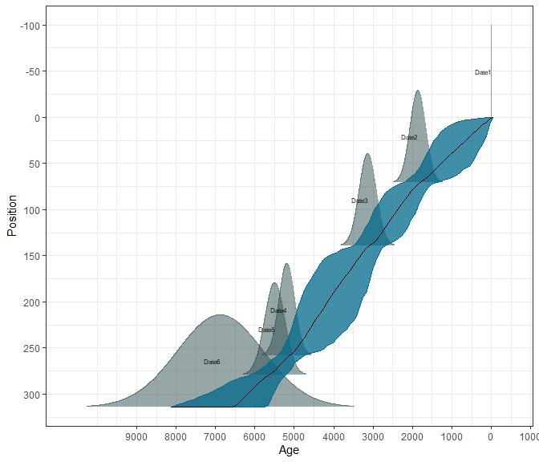
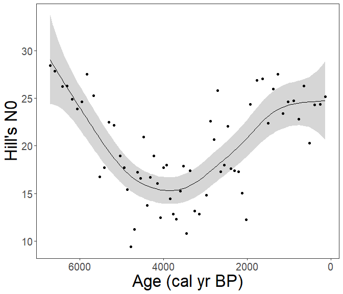

Step-by-step guide
================

This workflow should serve as step-by-step guidance starting from downloading a dataset from Neotoma and processing it, to estimating ecosystem property (diversity in this case).

:warning: **This workflow is only meant as an example**: There are several additional steps for data preparation which should be done for any fossil pollen dataset from Neotoma!

See [**FOSSILPOL**](https://hope-uib-bio.github.io/FOSSILPOL-website/), an R-based modular workflow to process multiple fossil pollen records to create a comprehensive, standardised dataset compilation, ready for multi-record and multi-proxy analyses at various spatial and temporal scales.

## Install packages

Please follow the [pre-workshop instructions](/docs/pre_workshop.html) to make sure all packages are installed.

## Attach packages

``` r
library(tidyverse) # general data wrangling and visualisation
library(pander) # nice tables
library(neotoma2) # obtain data from the Neotoma database
library(Bchron) # age-depth modeling
library(REcopol) # estimating diversity
library(mgcv) # GAM fitting
library(gratia) # GAM visualisation
library(janitor) # string cleaning
```

## Download a dataset from Neotoma

Here we have selected the **Ahakagyezi Swamp** record.

``` r
sel_dataset_download <-
  neotoma2::get_downloads(50216)
```

## Prepare the pollen counts

``` r
# get samples
sel_counts <-
  neotoma2::samples(sel_dataset_download)

# select only "pollen" taxa
sel_taxon_list_selected <-
  neotoma2::taxa(sel_dataset_download) %>%
  dplyr::filter(element == "pollen") %>%
  purrr::pluck("variablename")

# prepare taxa table
sel_counts_selected <-
  sel_counts %>%
  as.data.frame() %>%
  dplyr::mutate(sample_id = as.character(sampleid)) %>%
  tibble::as_tibble() %>%
  dplyr::select("sample_id", "value", "variablename") %>%
  # only include selected taxons
  dplyr::filter(
    variablename %in% sel_taxon_list_selected
  ) %>%
  # turn into the wider format
  tidyr::pivot_wider(
    names_from = "variablename",
    values_from = "value",
    values_fill = 0
  ) %>%
  # clean names
  janitor::clean_names()

head(sel_counts_selected)[, 1:5]
```

| sample_id | rhamnaceae | combretaceae_melastomataceae | ranunculaceae | prunus |
|:---------:|:----------:|:----------------------------:|:-------------:|:------:|
|  500543   |     1      |              1               |       1       |   1    |
|  500544   |     4      |              0               |       0       |   2    |
|  500545   |     6      |              1               |       0       |   0    |
|  500547   |     4      |              0               |       0       |   0    |
|  500548   |     7      |              0               |       0       |   0    |
|  500549   |     3      |              1               |       0       |   1    |

Here, we strongly advocate that attention should be paid to the selection of the ecological groups, the selection of depositional environments, as well as the harmonisation of the pollen taxa. However, that is not the subject of this workflow, but any analysis to be published needs careful preparation of the fossil pollen datasets!

We can now try to visualise the taxa per sample_id

``` r
sel_counts_selected %>%
  tibble::rowid_to_column("ID") %>%
  tidyr::pivot_longer(
    cols = -c(sample_id, ID),
    names_to = "taxa",
    values_to = "n_grains"
  ) %>%
  ggplot2::ggplot(
    mapping = ggplot2::aes(
      x = ID,
      y = n_grains,
      fill = taxa
    ),
  ) +
  ggplot2::geom_bar(
    stat = "identity",
    position = "fill"
  ) +
  ggplot2::labs(
    x = "sample_id",
    y = "proportion of pollen grains"
  ) +
  ggplot2::theme(
    axis.text.x = ggplot2::element_blank(),
    legend.position = "none"
  )
```


## Preparation of the levels

### Sample depth

Extract depth for each level

``` r
sel_level <-
  neotoma2::samples(sel_dataset_download) %>%
  tibble::as_tibble() %>%
  dplyr::mutate(sample_id = as.character(sampleid)) %>%
  dplyr::distinct(sample_id, depth) %>%
  dplyr::relocate(sample_id)

head(sel_level)
```

| sample_id | depth |
|:---------:|:-----:|
|  500543   |  703  |
|  500544   |  753  |
|  500545   |  803  |
|  500547   |  853  |
|  500548   |  908  |
|  500549   |  953  |

### Age-depth modelling

We highly recommend recalculating the age-depth model ‘de Novo’ as different methodologies might have been applied to each record. However, age-depth modelling is a very complicated topic, which we will not dig into today. Just note that many parts of the age-depth modelling need attention (selection of chronology control points, using correct calibration curves, etc.).

Let’s load a model, which we already prepared.

``` r
ad_model <-
  readr::read_rds(
    here::here("R/Data/bchron.rds")
  )
```

Visually check the age-depth models

``` r
plot(ad_model)
```



#### Predict ages

``` r
age_position <-
  Bchron:::predict.BchronologyRun(object = ad_model, newPositions = sel_level$depth)

age_uncertainties <-
  age_position %>%
  as.data.frame() %>%
  dplyr::mutate_all(., as.integer) %>%
  as.matrix()

colnames(age_uncertainties) <- sel_level$sample_id

# Let's take the median age of all possible ages (i.e. the estimated age
#   from each age-depth model run) as our default.
sel_level_predicted <-
  sel_level %>%
  dplyr::mutate(
    age = apply(
      age_uncertainties, 2,
      stats::quantile,
      probs = 0.5
    )
  )
```

### Visualisation of our data

Let’s now make a simple pollen diagram with proportions of the main pollen taxa (x-axis) against our estimated ages along depth (y-axis).

``` r
sel_counts_selected %>%
  tibble::column_to_rownames("sample_id") %>%
  RRatepol:::transform_into_proportions() %>%
  tibble::rownames_to_column("sample_id") %>%
  dplyr::inner_join(
    sel_level_predicted,
    by = dplyr::join_by(sample_id)
  ) %>%
  tidyr::pivot_longer(
    cols = -c(sample_id, depth, age),
    names_to = "taxa",
    values_to = "proportion_of_grains"
  ) %>%
  dplyr::group_by(taxa) %>%
  # Calculate the average proportion of grains
  dplyr::mutate(
    avg_prop = mean(proportion_of_grains)
  ) %>%
  # Only keep the main taxa
  dplyr::filter(avg_prop > 0.01) %>%
  dplyr::ungroup() %>%
  ggplot2::ggplot(
    mapping = ggplot2::aes(
      y = age,
      x = proportion_of_grains,
      xmax = proportion_of_grains,
      xmin = 0,
      fill = taxa,
      col = taxa
    ),
  ) +
  ggplot2::geom_ribbon() +
  ggplot2::scale_y_continuous(trans = "reverse") +
  ggplot2::scale_x_continuous(breaks = c(0, 1)) +
  ggplot2::facet_wrap(~taxa, nrow = 1) +
  ggplot2::theme(
    legend.position = "none"
  )
```


## Estimation of ecosystem property

Now we will use our prepared fossil pollen data to estimate the diversity. We will use {REcopol} package, which has easy-to-use functions to analyse fossil pollen data. See package [website](https://hope-uib-bio.github.io/R-Ecopol-package/) for more informations. Specifically, we will estimate rarefied values of [Hill numbers](https://esajournals.onlinelibrary.wiley.com/doi/abs/10.2307/1934352).

``` r
data_diversity <-
REcopol::diversity_estimate(
  data_source = sel_counts_selected,
  sel_method = "taxonomic"
)
```

Now we can fit a temporal trend as a GAM model.

``` r
data_to_fit <-
  dplyr::inner_join(
    data_diversity,
    sel_level_predicted,
    by = "sample_id"
  )

mod_n0 <-
  mgcv::gam(
    n0 ~ s(age, k = 12, bs = "tp"),
    data = data_to_fit,
    method = "REML",
    family = mgcv::tw(link = "log")
  )

summary(mod_n0)
#> 
#> Family: Tweedie(p=1.01) 
#> Link function: log 
#> 
#> Formula:
#> n0 ~ s(age, k = 12, bs = "tp")
#> 
#> Parametric coefficients:
#>             Estimate Std. Error t value Pr(>|t|)    
#> (Intercept)  2.94459    0.03139   93.81   <2e-16 ***
#> ---
#> Signif. codes:  0 '***' 0.001 '**' 0.01 '*' 0.05 '.' 0.1 ' ' 1
#> 
#> Approximate significance of smooth terms:
#>          edf Ref.df     F p-value    
#> s(age) 4.661  5.753 24.02  <2e-16 ***
#> ---
#> Signif. codes:  0 '***' 0.001 '**' 0.01 '*' 0.05 '.' 0.1 ' ' 1
#> 
#> R-sq.(adj) =  0.762   Deviance explained = 77.4%
#> -REML = 146.79  Scale est. = 0.82852   n = 49

# mgcv::gam.check(mod_n0)
```

Now we can visualise the results.

``` r
age_dummy <-
  gratia::data_slice(
    mod_n0,
    age = gratia::evenly(age)
  )

data_predicted <-
  REcopol::predic_model(
    model_source = mod_n0,
    data_source = age_dummy
  )

data_predicted %>%
  ggplot2::ggplot(
    mapping = ggplot2::aes(
      x = age,
      y = fit
    )
  ) +
  ggplot2::geom_ribbon(
    mapping = ggplot2::aes(
      ymin = lwr,
      ymax = upr
    ),
    alpha = 0.2
  ) +
  ggplot2::geom_line() +
  geom_point(
    data = data_to_fit,
    mapping = ggplot2::aes(
      y = n0
    )
  ) +
  ggplot2::scale_x_continuous(
    trans = "reverse"
  ) +
  ggplot2::labs(
    y = "Hill's N0",
    x = "Age (cal yr BP)"
  )
```


