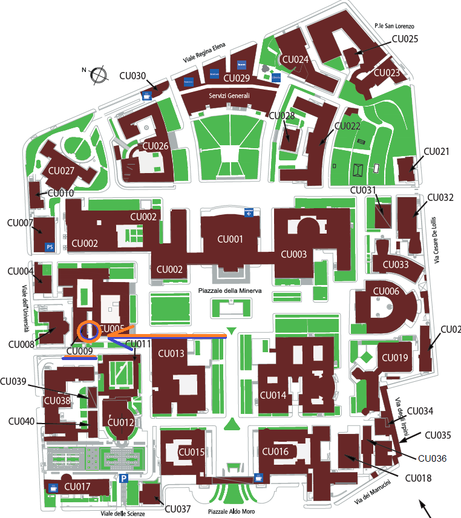
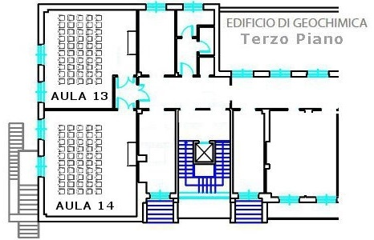

Workshop Information
================

The workshop entitled **“How can paleoecological-data be used to help define safe operating spaces?”** is going to take place during [INQUA 2023](https://inquaroma2023.org/) Conference.

 

## When/Where

-   Date: **16.07.2023**
-   Time: **14:00 - 16:00**
-   Location: **Room 14, Building Scienze della Terra, entrance Geochimica (CU009), third floor**

 

## Programme

| Time (Rome)                                                                        | Topic                                                                                                                                  | Presenter                                                     |
|------------------------------------------------------------------------------------|----------------------------------------------------------------------------------------------------------------------------------------|---------------------------------------------------------------|
| 14:00 - 14:15                                                                      | Welcome and introduction to Planetary Boundaries key concepts                                                                          | Lindsey Gillson                                               |
| 14.15 - 16.45 (including coffee break)                                             | Workflows developed to process pollen data to estimate components of ecosystem change                                                  | Ondrej Mottl and Alistair Seddon                              |
| 16.45- 17.45 (Group divides into 2 and swaps between 2 tables for 30 minutes each) | **world café format**: Planetary boundaries indicator metrics (OM and AS) / Case studies \[and sign up for meta-analysis\] (KK and KZ) | Ondrej Mottl and Alistair Seddon / Kelly Kirsten and Ke Zhang |
| 17.45 - 18:00                                                                      | Wrap up and ways forward                                                                                                               | Lindsey Gillson                                               |

 

## Presenters

-   ### Lindsey Gillson 

    -   (lindsey.gillson@uct.ac.za) 
    -   University of Cape Town, South Africa

 

 

 

-   ### Ondřej Mottl 

    -   (ondrej.mottl@gmail.com) 
    -   Center for Theoretical Sciences, Charles University, Prague, Czech Republic

 

 

 

-   ### Alistair Seddon 

    -   (Alistair.Seddon@uib.no) 
    -   University of Bergen, Norway

 

 

 

-   ### Kelly Kirsten 

    -   (klkirsten@hotmail.com) 
    -   Coventry University, Coventry, Great Britain

 

 

 

-   ### Ke Zhang 

    -   (kzhang@niglas.ac.cn) 
    -   Nanjing Institute of Geography and Limnology, Chinese Academy of Sciences , China
